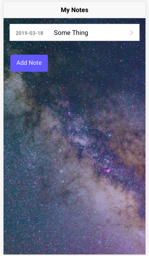
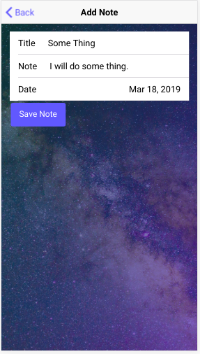
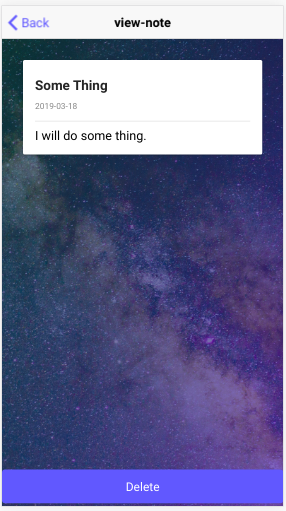

# Notes-App
Build a full-featured note taking app using the Ionic framework.
Ionic is an open-source SDK for hybrid mobile app development built on Angular. 

# Run:
Home Page          |  Add Note Page          |  View Note Page
:-------------------------:|:-------------------------:|:-------------------------:
 |   | 
